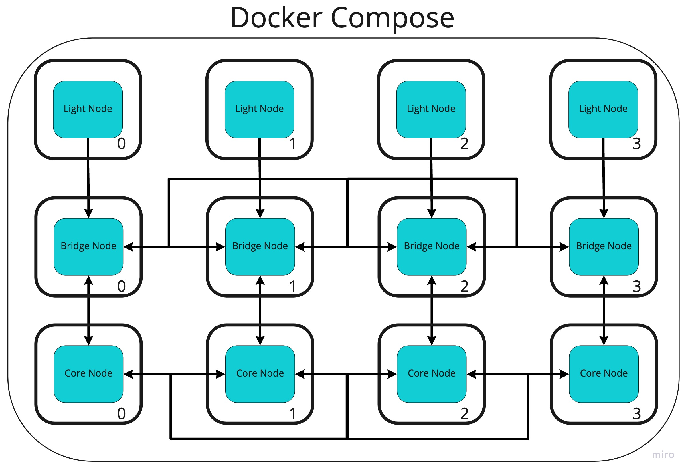
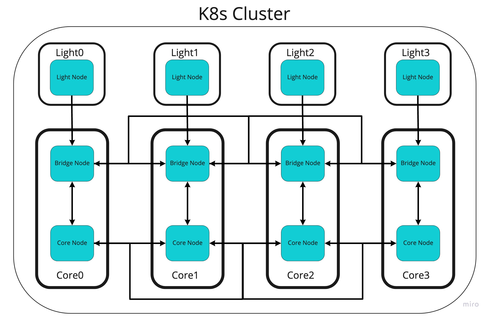

# Devnet

This directory contains contiguration files to standup a Celestia devnet consisting 4 Core Nodes, 4 Bridge Nodes, and 4 Light nodes. 

This can be done using either Docker Compose or Kubernetes.

## Docker Compose

The docker compose files will standup a cluster that looks like the below picture



> ⚠ The preconfigured nodekeys for the bridge and light nodes must have the correct permissions set.  
> The first time you setup the cluster you should run
> ```
> chmod 0600 celestia-node/full/*/nodekey* && chmod 0600 > celestia-node/light/*/nodekey*
> ```

To setup the docker compose cluster run
```
./start-docker.sh
```
> This will take about a minute as you must first wait for the core nodes to generate a block before the full nodes can be started (the first sleep) and then wait for the full nodes to sync a block before starting the light nodes (the second sleep).

To stop the docker compose cluster run
```
./stop-docker.sh
```

To retrieve logs from the cluster run
```
docker-compose -f docker/<node-type>-docker-compose.yml logs
```
eg.
```
docker-compose -f docker/light-docker-compose.yml logs
```

## Kubernetes (K8s)

The Kubernetes config files will standup a cluster that looks like the below picture



To setup the Kubernetes cluster run
```
kubectl create -f k8s/core-nodes -R && \
echo "Waiting 45s for core nodes to produce a block" && \
sleep 45s && \
kubectl create -f k8s/light-nodes -R
```

> This will take about a minute as you must first wait for the core nodes to generate a block before the full nodes can be started (this is configured within the K8s files) and then wait for the full nodes to sync a block before starting the light nodes (the sleep command).

To list all of the pods in the cluster run
```
kubectl get pods
```

To retrieve logs from the cluster run
```
kubectl logs -l app=<deployment-name> -c <node-type><node-num>   
```
eg.
```
kubectl logs -l app=core0 -c celestia-node   
```
or
```
kubectl logs -l app=core0 -c celestia-app   
```
or
```
kubectl logs -l app=light0
```

You can also retrieve logs using a pods name
```
kubectl logs core0-5d49b5db67-lb4hf -c celestia-node
```